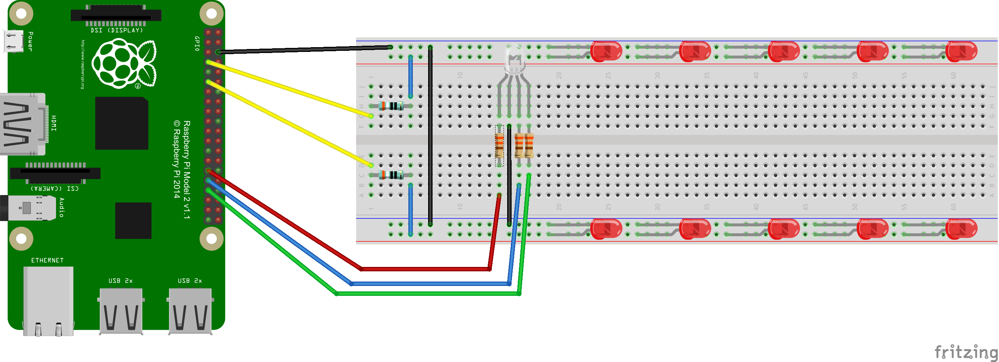
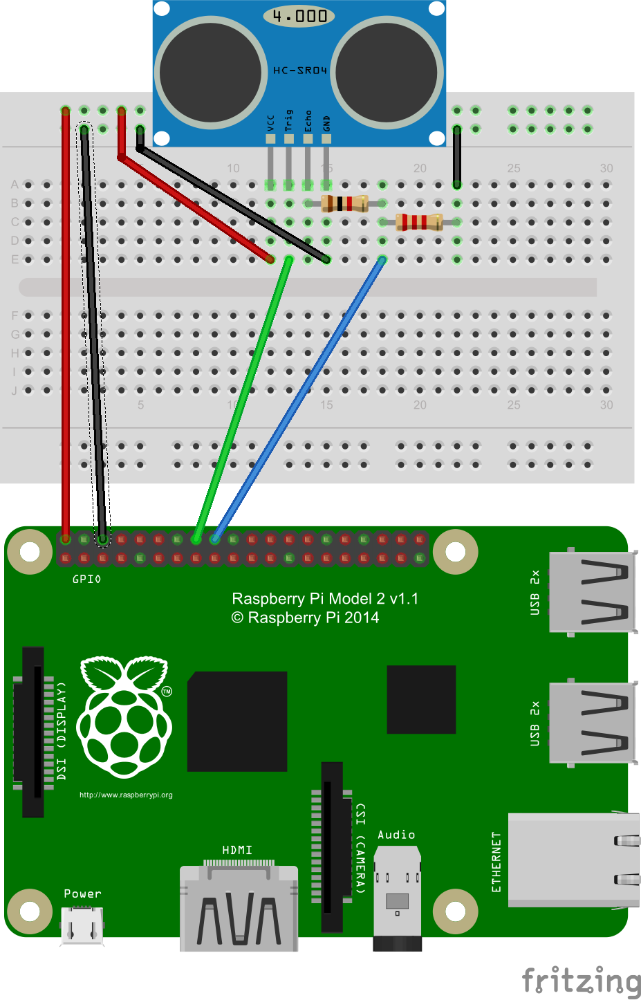

# ConnectedChristmasTree >> README.md

Configure the CCTLightController project:
 - rename the config.json.dev file to config.json
 - replace the placeholders in the file with your IoTHub settings
 - set its build action to 'Content'
 - set its copy action to 'Copy Always'

Create the Christmas Tree with a Rpi2 and some leds, resistors and one RGB Led:

Create the HR Sensor for activating the Emotion Detector camera with this schema:

Bill of materials:
* IoT Hub with a consumer group named "cloudservice"
 * You must register your devices in the IoT Hub with the Device manager application
* A CloudService where you will deploy the MessagesService WorkerRole
* Two Raspberry Pi 2
* A bunch of LEDs
* An RGB LED
* An HC-SR04 distance sensor
* Two Breadboards
* Resistors:
 * 1x 1K&ohm;
 * 1x 2.2K&ohm;
 * 3x 330&ohm;
 * 2x 390&ohm;