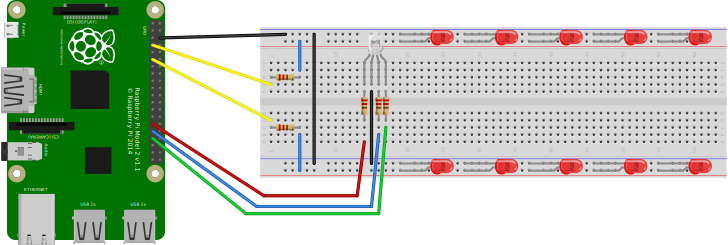

# ConnectedChristmasTree >> README.md

Configure the CCTLightController project:
 - rename the config.json.dev file to config.json
 - replace the placeholders in the file with your IoTHub settings
 - set its build action to 'Content'
 - set its copy action to 'Copy Always'

Create the Christmas Tree with a Rpi2 and some leds, resistors and one RGB Led:

